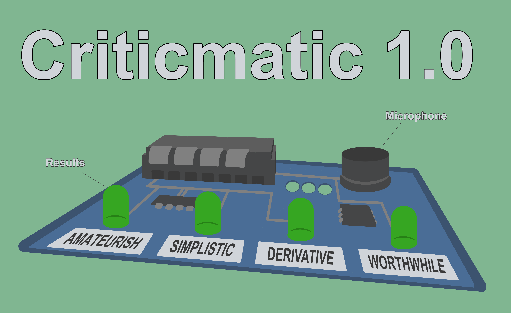

# Personal Project: Criticmatic

Most of us find it hard to make time in our busy schedules to read, so when we finally get around to opening the book that’s been gathering dust on our shelf it’s important to make sure we’re reading something worthwhile; you don’t want to spend hours reading some worthless drivel, but you want something that you can use to impress on your friends how well-read and sophisticated you are.

Finding something with literary value can be difficult however: if you walk into your local bookstore it’s easy to get overwhelmed by the vast quantity of reading material available, and separating the wheat from the chaff can be an impossible task. Sure, many books have reviews, but those are often lengthy themselves. I offer an alternative: a simple device that can determine whether or not a book will be worth your time based on only a couple of sentences. Simply pick a book, dictate a few lines, and you will immediately be notified of the work’s most important characteristics.

With this revolutionary technology, you’ll be able to contribute to any conversation your pretentious friends are having, while still having plenty of time to catch up on your favorite Netflix series.

### Project Details

Criticmatic is a device that rates literature based on a few sentences: you dictate them into a microphone, the device will evaluate them using speech-to-text, and return a verdict by lighting up one (or several) LED lights corresponding to a variety of characteristics, like ‘derivative’ or ‘worthwhile’.

Obviously it’s impossible to evaluate the value of a piece of literature based on a couple of sentences, let alone using software. The project is intended as satire, attempting to highlight the futility of trying to rate a piece of art, especially with something as reliant on personal experience as reading books.

This is the postcard based on the Criticmatic concept:

The Arduino has a microphone, activated by pressing a button, linked to a PC with a small speech recognition program, which will evaluate the resulting text on arbitrary parameters like average word length, alliteration, usage of specific words, and others. Based on those parameters it will light up a LED light corresponding to one or more of the following terms:

    Derivative
    Worthwhile
    Groundbreaking
    Simplistic
    Amateurish

### Technology
While I wasn't able to implement much on the hardware side, I did investigate and prototype on the software side. Much of my eary forays were into speech-to-text, which proved remarkably easy to implement with publicly available libraries. A lot of my other prototyping regarded the 'algorithm' that would evaluate the resulting text, and somehow make meaningful statements about it. This is obviously nearly impossible, but I did implement small things like recognising specific words, or checking how often words were used in the English language, the code for which can be found [here](Algorithm%20Code) Actually extracting meaning from the text is much more difficult, and I looked into options for achieving this at a basic level (a lot of the research involved AI interpretation), but never managed to actually get anything working.
